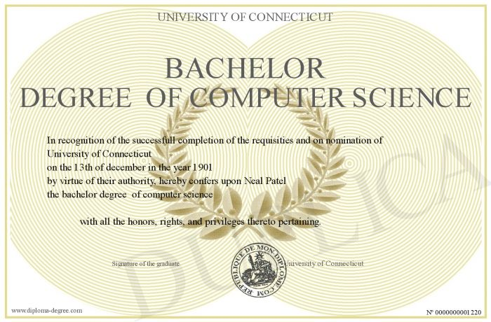

# Careers in Computer Science - Daniel

## **Senior Software Engineer** 

A senior software engineer works together with a software team to develop
information systems by studying operations. Their main job is to develop and 
install software solutions. They also supervise a group of programmers and 
create new websites, as well as maintain those that already exist.

### **Responsibilities:** 
***

* Develop software solutions by studying information needs
* Create documentation, flowcharts, layouts, diagrams, and charts to describe and show solutions
* Study the most recent programming languages, computer hardware, and development tools to update your knowledge for the job
* Protect operations by keeping information confidential 
* Supporting and fostering the growth of software developers by offering guidance, mentoring, and educational opportunities
* Expand engineering teams through hiring, recruiting, and interviewing

### **Required Education:**
***

>* Bachelor or Master’s degree in appropriate field of study
>* 5+ years of experience as a software engineer
>* 4+ years of professional experience in web development
 
### **Technical and Non-technical Skills:**
***

> 
<em>Communication skills:</em> A senior software engineer needs to communicate with group members, testers, and mentor new software engineers

> 
<em>Programming skills:</em> A senior software engineer is required to have proficiency in multiple languages such as Javascript and PHP

> 
<em>Software Testing:</em> Needs to be able to test softwares to ensure that the program runs properly before sending it to the testing team

*** 

Salary Range in Toronto, ON Area: <em>$88,000 to $158,000</em> 

Average salary in Toronto, ON Area: <em>$117,920</em>

***

## University of Waterloo - Bachelor’s degree in Computer Science
| Entrance Requirements        | First Year Courses           | Additional Requirements  |
| ------------- |:-------------:| -----:|
|   Advanced Functions    | CS 135 – Designing Functional Programs: Aimed at CS majors and uses a functional programming approach to code programs | One communications skills course |
| Calculus and Vectors | MATH 135 – Algebra for Honors Mathematics: An introduction to mathematics and proof techniques through the study of basic algebraic systems | 3 electives in your first year |
| Any Grade 12 U English | CS 136 – Elementary Algorithm Design and Data Abstraction: Introduces the design and analysis of algorithms |N/A|
| Any Other 4U Course | CS 136L – Tools and Techniques for Software Development: Introduces tools and techniques useful in the software development lifecycle|  N/A| 

<strong>Estimated Time to complete degree:</strong> 4 years

***

### Opportunities for Gaining Work Experience:

Opportunity #1:
[Hack the North (Hackathon)](https://hackthenorth.com/) - 
Apply to Hack the North, which is an all expense paid hackathon where programmers and engineers of various skill levels come together to work on projects in groups. This event happens over a weekend and only lasts a few days, so participants have to learn how to manage their time and work collaboratively with others.

Opportunity #2:
[Co-op Program](https://cs.uwaterloo.ca/future-undergraduate-students/co-op-and-regular) - 
Take the co-op program at University of Waterloo. This allows you to graduate with up to 2 years of work experience and create valuable connections before graduation.

Opportunity #3:
[App Building](https://developer.android.com/training/basics/firstapp) - 
Build an app on google play store as a self-starter project. Not only will you learn important programming skills, but you will also have to understand user interests and calculate the costs behind each expense. Additionally, if you are working together with a group of friends, this could be a good opportunity to take on a leadership role.

***
## Job Examples

### Entry level position (0-2 years of job experience): 

**Employer:** [Rose Rocket](https://jobs.lever.co/roserocket/bedc559e-b08c-4473-9884-c76e2ac059cb?lever-source=Indeed.)

**Salary:** $60,000 - $83,000/ year

**City:** Toronto, Ontario

**Job description:**

We're looking for Junior Software Engineers to help us tackle a range of exciting challenges on our Platform & Test team. Our work is focused on building new features and workflows that will expand the usability of our product to a wider range of customers. In layman’s terms, we’re building modern stuff that can reach more people. We focus on features and workflows that make the hard work of moving freight easier, and sometimes even delightful. We also focus on developing platform tools that improve the Rose Rocket developer experience and the speed at which we can build features.

**Additional skills required:**
* Some experience with a modern JavaScript framework such as React, Vue, Svelte, or Angular
* Experience writing REST APIs
* Some experience with SQL
* Some proficiency in Version Control Systems like Git / SVN / Mercurial
  
***
### Mid level position (4+ years of job experience): 

**Employer:** [Opulence Global](https://ca.indeed.com/viewjob?jk=e91d31589da2e06f&from=cobra_vj&tk=1gen7qlubir1b800&iaal=1.)

**Salary:** $74,000 - $110,000/ year

**City:** Richmond Hill, Ontario

**Job description:**

Opulence Global is looking for a passionate Software Engineer who is able to configure their own development environment and has strong knowledge in Object Oriented Programming, as well as, Software Architecture and Design. This individual is self-motivated and requires minimal supervision. Ultimately, the role of the Software Engineer is to build high-quality, innovative and fully performing software that complies with coding standards and technical design.

**Additional skills required (2+ refers to 2+ years):**
* 2+ Object Oriented Programming strong fundamental is a must
* 2+ Software Architecture strong fundamental is a must
* 2+ Database Architecture Relational and NoSQL
* 2+ Cloud-based Experience in AWS (EC2, ECS, API GATEWAY, EBS) is a must
* 2+ PHP, LARAVEL is an asset
* 2+ FrontEnd Technologies like REACT, and VUE is a must
* 2+ Docker, configuring and deployment with dockerfile or docker-compose is a must
* 2+ Memcache like REDIS or AWS ELASTICACHE
* 2+ APACHE Kafka or any EVENT DRIVEN server
* 2+ Experience in microservices is desired

***
### Senior level position (5+ years of experience):

**Employer:** [CAPX](https://ca.indeed.com/viewjob?jk=761c4684fb0f84a8&from=cobra_vj&tk=1gen85oehg0nr800&iaal=1.)

**Salary:** $110,000 - $220,000/ year

**City:** Toronto, Ontario

**Job description:** 

We are looking for a software engineer with a proven track record of having worked within a dynamic environment where change is the only   constant. The ideal candidate will not only have required technical background, but also a keen interest in innovation, risk taking, strong written and verbal communication skills, analytical mindset and drive to take on challenges to achieve all things difficult.

**Additional skills required:**
* Well-versed in ES6, HTML5 and CSS3/SCSS.
* Demonstrable expertise in JavaScript in general and in Node.js, React and MongoDB in specific – this is our primary requirement for qualifying a candidate.
* Detailed full stack experience in a TDD environment.

***
**Work Cited**

“All Software Engineer Jobs in Markham, on | Workopolis.” Workopolis.com, 3 Oct. 2022, www.workopolis.com/jobsearch/find-jobs?ak=software+engineer&l=Markham%2C+ON&job=3FeLqEErAobGqbQv_2jbS594Wi7i6V2wzcPAFSCGKiZXYJv9p1GdBA

“Build Your First App  |  Android Developers.” Android Developers, 2022, 
https://developer.android.com/training/basics/firstapp

“Computer Science.” Undergraduate Programs, 9 July 2021, 
www.uwaterloo.ca/future-students/courses/computer-science

“Hack the North.” Hackthenorth.com, 2022, www.hackthenorth.com/

“Rose Rocket - Junior Software Engineer.” Lever.co, 2022, 
https://jobs.lever.co/roserocket/bedc559e-b08c-4473-9884-c76e2ac059cb?lever-source=Indeed

“Salary: Senior Software Engineer in Toronto, on 2022.” Glassdoor.ca, 2022,
www.glassdoor.ca/Salaries/toronto-senior-software-engineer-salary-SRCH_IL.0,7_IM976_KO8,32.htm

“Software Developer - Toronto, on - Indeed.com.” Indeed.com, 2021, 
www.indeed.com/viewjob?jk=761c4684fb0f84a8&from=cobra_vj&tk=1gen85oehg0nr800&iaal=1

“Software Engineer - Richmond Hill, on - Indeed.com.” Indeed.com, 2022, 
www.indeed.com/viewjob?jk=e91d31589da2e06f&from=cobra_vj&tk=1gen7qlubir1b800&iaal=1

TopResume Editor. “Senior Software Engineer Job Description | Job Description 
Examples.” TopResume, Senior Software Engineer Job Description | Job Description Examples | TopResume, 22 Dec. 2016, www.topresume.com/career-advice/senior-software-engineer-job-description

**Images Cited**

Downer, Gavil. “University of Liverpool.” Pinterest, Pinterest, 31 Jan. 2013, 
www.pinterest.ca/pin/532409987168129175/

TopResume Editor. “Senior Software Engineer Job Description | Job Description Examples.” 
TopResume, Senior Software Engineer Job Description | Job Description Examples | TopResume, 22 Dec. 2016, www.topresume.com/career-advice/senior-software-engineer-job-description

